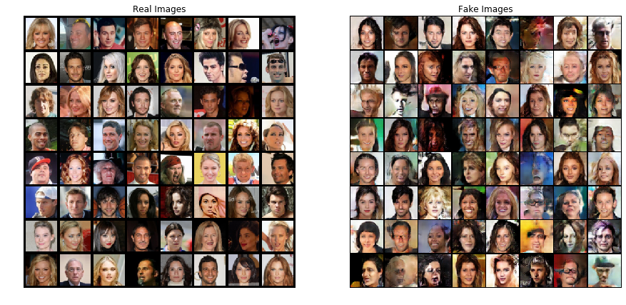
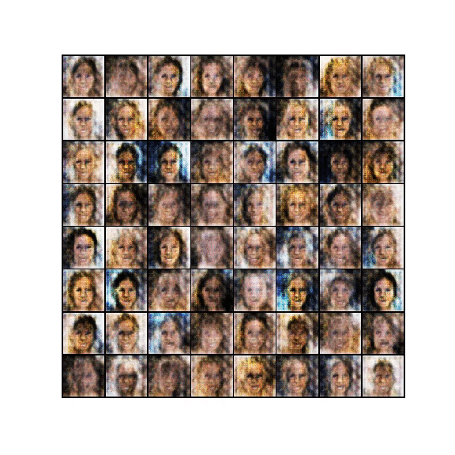
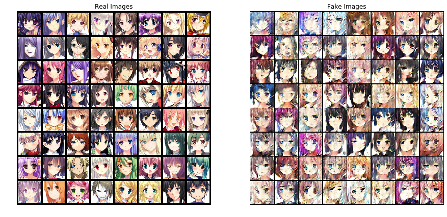
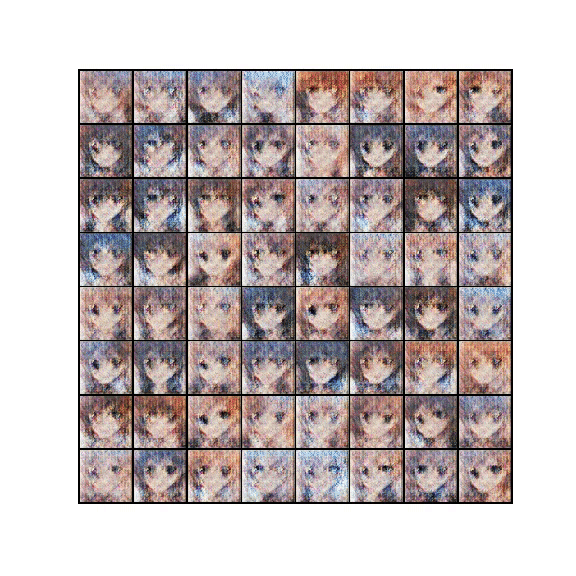

# DCGAN

Based on this [tutorial](https://pytorch.org/tutorials/beginner/dcgan_faces_tutorial.html).

## Celebrity

## Anime

## Datasets

- [Celebrities](https://www.kaggle.com/greg115/celebrities-100k)
- [Anime](https://www.kaggle.com/soumikrakshit/anime-faces)

